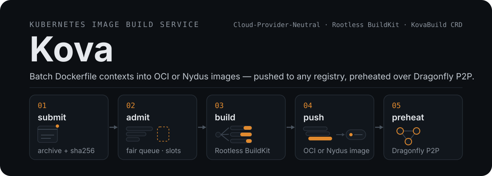

<p align="center">
  
</p>

<p align="center">
  <a href="https://github.com/cofy-x/kova/actions/workflows/ci.yml"></a>
  <a href="LICENSE"></a>
</p>

<p align="center">
  <a href="README.md">English</a> | 中文
</p>

Kova 是 agentic infrastructure 中云中立的 seed image build execution plane。它验证不可变 source bundle，调度 BuildKit，推送 OCI 或 Nydus 镜像，并返回经过验证的 OCI manifest digest。

## 快速开始

你需要一个 Kubernetes 集群、支持 OCI 的 Helm，以及 `kubectl`。从 [GitHub releases](https://github.com/cofy-x/kova/releases) 选择一个 tag，保证 chart、CLI 和运行时镜像版本对齐。Linux、macOS 和 Windows 的 CLI 归档（附 provenance 证明）也发布在同一页面。

安装 CLI：

```bash
go install github.com/cofy-x/kova/cmd/kova@latest
kova version
```

安装服务。快速开始配置使用生成的静态 token；共享环境应改用 TokenReview：

```bash
export KOVA_VERSION=vX.Y.Z
export KOVA_SERVICE_TOKEN=$(openssl rand -hex 32)
export KOVA_PLATFORM=linux/amd64 # 或 linux/arm64

kubectl create namespace kova --dry-run=client -o yaml | kubectl apply -f -
kubectl -n kova create secret generic kova-service-auth \
  --from-literal=token="${KOVA_SERVICE_TOKEN}"

helm show crds oci://ghcr.io/cofy-x/charts/kova \
  --version "${KOVA_VERSION#v}" | kubectl apply -f -
helm upgrade --install kova oci://ghcr.io/cofy-x/charts/kova \
  --version "${KOVA_VERSION#v}" \
  --namespace kova \
  --create-namespace \
  --set serviceDaemon.enabled=true \
  --set serviceDaemon.authentication.mode=static \
  --set serviceDaemon.authentication.staticPrincipal=kova:quickstart \
  --set serviceDaemon.authentication.staticTokenSecret.name=kova-service-auth \
  --set-string worker.platform="${KOVA_PLATFORM}" \
  --wait

kubectl -n kova create rolebinding kova-quickstart \
  --role=kova-service-submitter \
  --user=kova:quickstart
```

每次 Helm 升级前都必须先 apply 对应 release 的 CRD，因为 Helm 不会升级 chart `crds/` 目录下的文件。

运行第一个构建：

```bash
kubectl -n kova port-forward service/kova-service 8080:8080 &

kova ctx set --mode service --service-url http://127.0.0.1:8080 --use quickstart
kova doctor
kova job submit \
  --source-repository registry.example.com/team/kova-sources:quickstart \
  --target registry.example.com/team/image:dev \
  --platform "${KOVA_PLATFORM}" \
  ./image
kova job wait <job-id>
kova job results <job-id>
```

registry 凭证、Nydus 输出和批量归档见[安装与首次构建指南](docs/quickstart.md)。

## Python SDK

`kova-client` 是官方的 Python-first Service SDK，同时提供行为一致的 `KovaClient` 和 `AsyncKovaClient`。它只封装公开 HTTP v1 合同，不拥有 workflow 恢复、artifact retention 或 receipt 存储。

```bash
python -m pip install kova-client
```

```python
from kova_client import ClientConfig, CreateBuildRequest, KovaClient, Platform, TargetSpec

with KovaClient(ClientConfig.from_env()) as kova:
    job = kova.create_build(
        CreateBuildRequest(
            source_uri="oci://registry.example.com/team/sources@sha256:<manifest-digest>",
            source_digest="sha256:<source-content-digest>",
            targets=(TargetSpec("registry.example.com/team/seed:build-123", Platform.LINUX_AMD64),),
            concurrency=1,
            idempotency_key="build-123",
        )
    )
    terminal = kova.wait_build(job.id, timeout=600)
    if terminal.status == "succeeded":
        for output in kova.get_results(job.id).outputs:
            print(output.platform, output.immutable_ref, output.manifest_digest)
```

`create_build` 不会自动重试；调用方必须使用稳定的 idempotency key，并在 Kova 终态任务 TTL 到期前持久化 source identity、build ID、manifest digest 和服务端返回的 `immutable_ref`。完整合同见 [Python SDK 与调用方 receipt 示例](docs/service.md#python-sdk)。

## 为什么选择 Kova

- **不可变 source 到可信镜像** — 每个构建消费经过 digest 验证的 OCI 或 HTTPS source，并返回已推送单平台镜像的 manifest digest 和验证后的 platform。
- **有界执行模型** — 一个不可变 `KovaBuild` 最多接受 100 个 logical targets 并记录 200 个 concrete outputs；更大任务的分片和重试由调用方负责。
- **公平且不浪费算力的调度** — 排队任务按认证身份交错；准入控制为任务预留真实的 BuildKit worker 槽位。
- **隔离执行** — 每个任务一个 runner Pod，驱动共享的上游 rootless BuildKit worker；controller 和 runner 以非 root 运行并丢弃全部 capabilities。
- **Kubernetes 原生认证** — 默认使用 TokenReview 和 SubjectAccessReview；提交者无法接触 Pod、Secret 或其他用户的任务。
- **云厂商中立** — registry 和 API 凭证都是外部 Secret 输入；chart 不创建集群、云账号、对象存储或 registry。
- **可观测** — 稳定的 OpenTelemetry 指标覆盖排队延迟、任务时长和容量等待。

## 文档

- [文档地图](docs/README.md)：按任务选择指南。
- [安装与首次构建](docs/quickstart.md)：OCI chart、匹配版本的 CLI 和一次验证过的构建。
- [Service 任务工作流](docs/service.md)：不可变 source、身份、RBAC、有界结果和任务操作。
- [CLI 工作流](docs/cli-workflow.md)：面向开发和底层调试的直连 runner 构建。
- [运行时设计](docs/architecture.md)：角色、拓扑、构建/导出、预热和扩缩容流程。
- [Kubernetes 部署](docs/deployment/kubernetes.md)：registry 凭证、worker 规格和生产配置。
- [发布流程](docs/releases.md)：CLI 归档、OCI chart、运行时镜像、SBOM 和 provenance。
- [示例](examples/README.md)：构建输入示例和运行时冒烟服务。

## 参与开发

仓库要求 `go.mod` 声明的 Go 版本，以及 Docker、kind、Helm、kubectl、curl、zip 和 LMDB 开发头文件。

```bash
make test
make lint-scripts
make helm-template
make e2e-helm-quickstart   # 在 kind 上验证已发布 chart 的安装路径
```

更大范围的 E2E 覆盖见[验证矩阵](docs/testing.md)。欢迎贡献，完整的环境搭建和 PR 流程见[贡献指南](CONTRIBUTING.md)。漏洞请通过[安全策略](SECURITY.md)中的私有流程报告。

## 许可证

Kova 基于 [Apache License 2.0](LICENSE) 发布。
