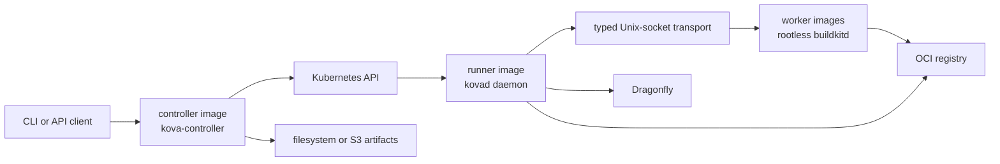

# Architecture

Kova is a cloud-provider-neutral Kubernetes image build service. It turns
Dockerfile contexts into OCI or Nydus images, pushes them to OCI registries,
and can preheat successful results through Dragonfly.

## Runtime Roles

Kova publishes three Linux image roles from the same version:

- **controller** runs `kova-controller service`, the authenticated HTTP API,
  and the `KovaBuild` controller. It does not contain BuildKit or Nydus tools.
- **runner** runs one isolated `kovad daemon` per job. It contains `buildctl`,
  `nydusify`, `nydus-image`, and diagnostic tools, but not `buildkitd`.
- **worker** runs upstream rootless BuildKit. It contains no Kova binary and
  provides shared execution and cache capacity.

The cross-platform `kova` CLI is distributed separately. It can operate a
runner directly for development or call a service deployment for platform
integration.

## Job and Storage Model

`KovaBuild` is the canonical service job. Its spec is immutable and contains
an artifact URI, SHA-256 digest, build options, and an optional idempotency
key. Status contains `observedGeneration`, a `Ready` Condition, timestamps,
the assigned runner, allocated concurrency, a typed result summary, and at
most 100 inline results.

The artifact store has two drivers:

- `filesystem` stores artifacts below a configured root. Kubernetes service
  deployments mount that root from a PVC.
- `s3` stores artifacts in an S3-compatible bucket. A runner init container
  downloads and verifies the source into a job-local `emptyDir`.

The full result set is persisted as JSON in the same store. Credentials are
read from Kubernetes Secrets and never copied into `KovaBuild` resources.

## Internal Protocol

The daemon listens on `/tmp/kova.sock`. Both the local CLI and the service
controller use a typed Go client and invoke the hidden `kovad transport`
command through Kubernetes exec. The transport streams request files and
responses over the Unix socket without constructing shell or `curl` commands.

## Worker Discovery and Scheduling

The Helm chart creates a headless Service for worker Pods. Runners resolve its
DNS name into independent BuildKit endpoints, keep the address pool refreshed,
apply consistent target placement, enforce per-worker concurrency, and cool
down workers after OOM-style failures.

The service controller adds a FIFO admission layer across jobs. It limits
active jobs with `maxActiveJobs` and divides `workerSlots` across admitted
jobs. Direct CLI runners remain an explicit development path and do not take
part in service-level admission.

## Topology

## Service Build Flow

1. The service authenticates the caller with Kubernetes TokenReview or an
   explicitly configured static token.
2. It stages the upload, validates the archive, computes its SHA-256 digest,
   and writes an immutable source artifact.
3. It creates an immutable `KovaBuild`. Reusing an idempotency key with
   different inputs returns a conflict.
4. FIFO capacity admission assigns runner concurrency and creates a runner
   Pod. S3 sources are materialized and verified by an init container.
5. The controller streams the source path to the daemon transport. The runner
   dispatches targets across healthy BuildKit workers.
6. The controller resolves registry descriptors, persists the full result
   artifact, updates typed status, and removes the job after its TTL.

## Security Boundaries

- Controller and runner containers run as UID/GID 65532 with all capabilities
  dropped and the runtime-default seccomp profile.
- Worker containers run upstream rootless BuildKit as UID/GID 1000. Rootless
  BuildKit requires unconfined seccomp and AppArmor plus
  `--oci-worker-no-process-sandbox`; it is not a privileged container.
- TokenReview is the default service authentication mode. `unsafe-none` must
  be selected explicitly and is intended only for isolated development.
- Registry, artifact, and API credentials are external Secret inputs.

## Observability

Stable OpenTelemetry metrics cover queue delay, job duration and outcomes,
capacity waits, artifact write latency and outcomes, authentication denials,
and cancellations. Labels are limited to bounded values such as phase, result,
and storage driver. `/healthz` remains an unauthenticated process liveness
endpoint.
