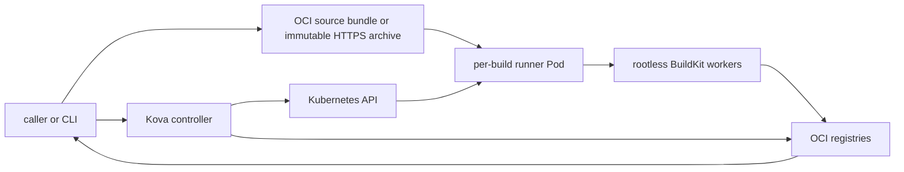

# Architecture

Kova is the seed image build execution plane for agentic infrastructure.
It accepts a verifiable immutable source reference, schedules BuildKit work, pushes OCI or Nydus images, and returns the pushed OCI manifest digest.
It is cloud-provider-neutral and can be used independently or called by Axern, Axrun, or another orchestrator through its public HTTP and CRD contracts.

Kova does not own episodes, seeds, workflow recovery, caller retries, long-term logs, or a general artifact lifecycle.
Those concerns remain with the caller.

## Public Contract

A build request contains:

- an `oci://` source URI pinned by OCI manifest digest, or an immutable HTTPS archive URI;
- the SHA-256 digest of the exact source zip bytes;
- 1–100 unique tagged output image references;
- bounded build options and an optional caller-scoped idempotency key.

The source zip contains top-level image directories with `Dockerfile` and `metadata.json` files.
`kova source push` and local `kova job submit` inputs create the same deterministic archive and publish it as `application/vnd.cofy.kova.source.v1+zip` in an OCI registry.
The returned source URI is manifest-digest-pinned.

Targets are normalized with the OCI reference parser and must be tagged push destinations.
Digest-only destinations are rejected.
The controller inspects the fetched and digest-verified archive before invoking BuildKit and requires its normalized target set to equal `spec.targets` exactly.
Missing, extra, invalid, or duplicate source targets produce `InvalidSource` or `InvalidTargets` without an image push.

The `KovaBuild` spec is immutable.
One build has at most 100 logical targets and at most 200 concrete outputs when `format=both`.
Each successful output contains only its format, image reference, and verified manifest digest.
Larger workloads are split by the caller into multiple `KovaBuild` resources that reuse the same immutable source contract.

The source bundle and output image are retained by registry policy or the caller.
Kova does not create a source store, result object, log object, garbage collector, or shared storage volume.

## Runtime Roles

Kova publishes three Linux image roles from the same release:

- **controller** runs the authenticated HTTP API and the `KovaBuild` controller;
- **runner** runs one isolated `kovad daemon` per build and includes the client-side build tools;
- **worker** runs upstream rootless BuildKit and provides shared execution and cache capacity.

## Build Flow

1. The caller creates or identifies an immutable source bundle and records its content digest.
2. The Service authenticates the caller, normalizes the request, and creates an immutable `KovaBuild`.
3. Capacity admission reserves BuildKit slots and creates one runner Pod.
4. A runner init container fetches the source from OCI or HTTPS, verifies its SHA-256 digest, and writes it to job-local `emptyDir` storage.
5. The controller inspects the archive and verifies exact equality with the requested target set.
6. The runner dispatches targets to shared BuildKit workers, which push the images.
7. The controller verifies pushed descriptors with bounded parallelism and records manifest digests.
8. The runner Pod and job-local source disappear after completion and TTL cleanup.

If a Pod, node, network, or BuildKit operation fails, Kova records a deterministic terminal failure.
The caller may submit a new build with the same source URI, digest, targets, and options because the input is immutable.
Kova does not resume or retry a failed build internally.

Different targets may use different OCI registries when credentials, networking, and TLS policy allow each destination.
Registry pushes are not transactional: a job can fail overall while status retains every successfully verified image digest.
Kova does not roll back pushed images, and callers must treat the manifest digest rather than a mutable tag as the result fact.

## Topology

## Failure and Log Semantics

Kova exposes runner logs only while the runner is active.
After terminal cleanup, the logs endpoint returns `410 Gone` rather than implying durable retention.
Callers that need long-term logs or evidence must stream or collect them into their own lifecycle system.

An idempotency key deduplicates an identical create request; it is not a retry counter.
A caller retry is a new request using the same immutable source contract, normally with a new idempotency key.

## Scheduling and Security

Queued builds are interleaved by authenticated requester and admitted against global, per-requester, and worker-slot limits.
Requested concurrency is between 1 and 100 and cannot exceed the logical target count.
Controller reconciles run concurrently, while a process-local admission lock preserves fair-share and slot accounting.
Registry descriptor verification is independently bounded to at most eight concurrent requests and never exceeds the admitted build concurrency.

Controller and runner containers run as UID/GID 65532 with all capabilities dropped and the runtime-default seccomp profile.
Rootless BuildKit workers run as UID/GID 1000 with the upstream-required no-process-sandbox configuration.
TokenReview and SubjectAccessReview are the production authentication boundary.
Registry and API credentials are external Kubernetes Secret inputs and are never copied into `KovaBuild` resources.

## Observability

Stable OpenTelemetry signals cover queue latency, capacity waits, terminal outcomes, authentication and authorization denials, cancellations, and build operations.
Kova telemetry is operational data, not a long-term per-build evidence store.
