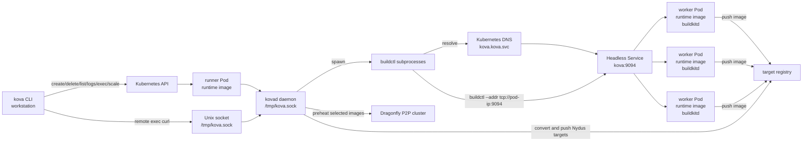
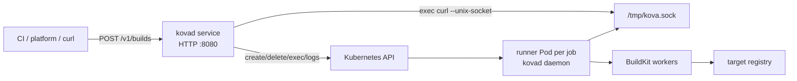
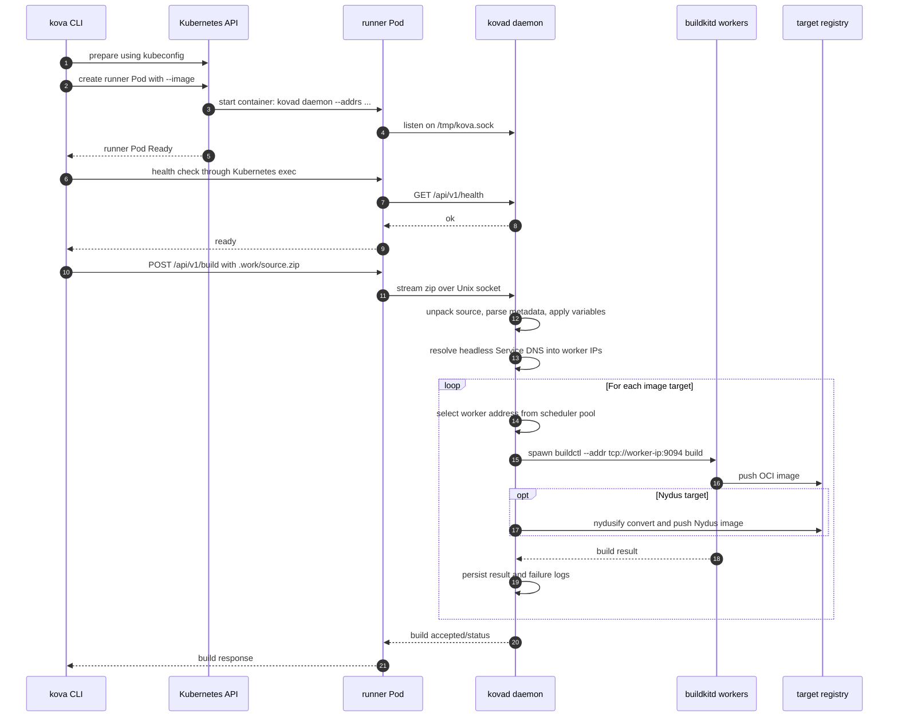
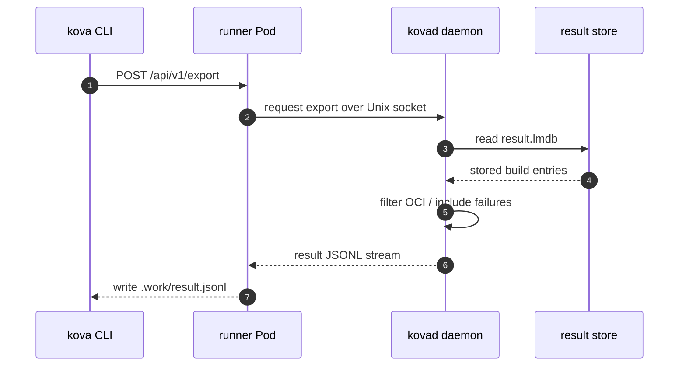
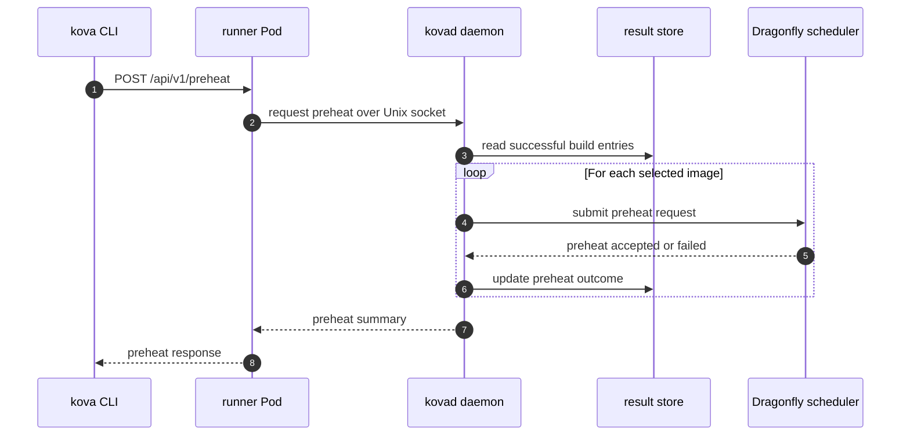
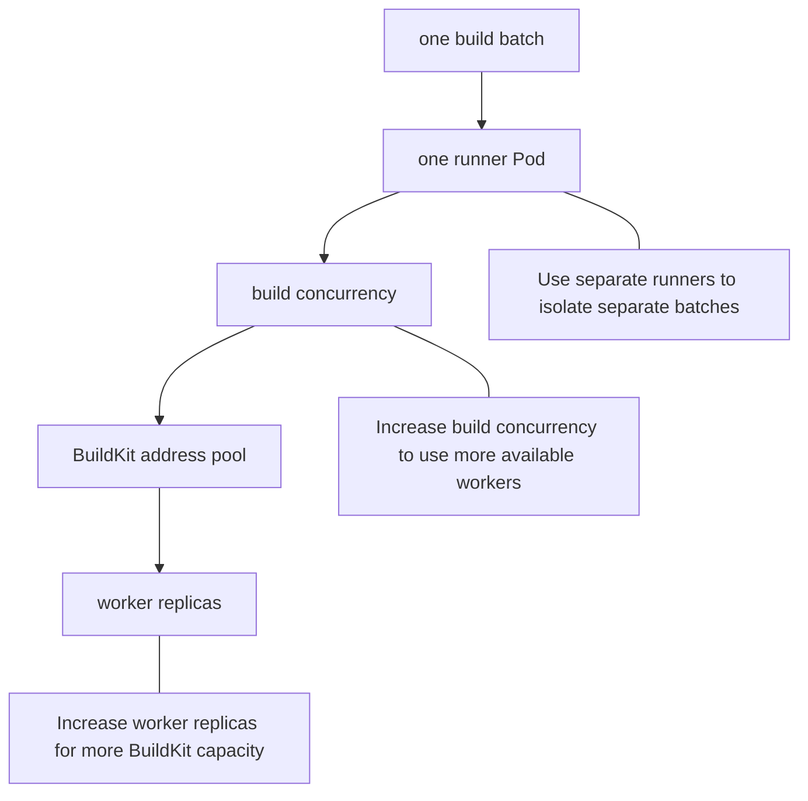

# Architecture

`kova` is a distributed image build service. It turns batches of
Dockerfile contexts into OCI or Nydus images, pushes them to a target registry,
and can preheat built images into a Dragonfly P2P cluster.

## Runtime Roles

- **kova CLI**: the `kova` binary running on a developer workstation or CI job.
  It uses the Kubernetes API to create runner Pods and send build, export,
  wait, log, exec, scale, and preheat requests.
- **runner**: a short-lived Pod for one build batch. It runs
  `kovad daemon`, owns the batch state, unpacks the source zip, records
  results, and dispatches work to BuildKit workers.
- **worker**: a `buildkitd` Pod deployed by the Helm chart. Workers execute
  BuildKit builds and push OCI image outputs to the configured registry. For
  Nydus targets, the runner converts the OCI output with `nydusify` and pushes
  the Nydus image.
- **store**: per-runner result storage. The runner writes build outcomes to
  `result.lmdb`, writes failure logs to `logs.jsonl`, and exports selected
  records to `.work/result.jsonl` in local E2E flows.
- **service daemon**: optional long-running HTTP gateway deployed in the
  cluster. It accepts `/v1/builds` requests, creates one runner Pod per job, and
  proxies status, logs, export, preheat, and cancel operations to that runner.

Each build batch should usually use an independent runner. Build throughput is
scaled mainly by increasing worker replicas and build concurrency. A single
runner distributes its batch across available worker addresses.

## Runtime Image And Processes

Kova uses one runtime image for both runner and worker Pods. The Pod command
selects the role:

- runner Pods start `kovad daemon --addrs <buildkit-addresses>`
- worker Pods start `buildkitd --config /etc/buildkit/buildkitd.toml --addr
  tcp://0.0.0.0:9094`

The runtime image contains `kovad` and the external tools used by the runtime
roles:

- `kovad`: Kova runtime daemon and service entrypoint
- `buildctl`: the upstream BuildKit client used by the runner daemon
- `buildkitd`: the upstream BuildKit daemon used by worker Pods
- `nydusify` and `nydus-image`: Nydus conversion tools
- `grpcurl`: diagnostics and runtime checks

The local `kova` CLI is a Kubernetes client. During `prepare`, it uses the
configured kubeconfig to create the runner Pod. The runner Pod then starts
`kovad daemon` and listens on `/tmp/kova.sock`. Later local commands use
Kubernetes exec to call the daemon through that Unix socket.

For service-style deployments, `kovad service` runs as a separate long-lived
Deployment. It uses in-cluster Kubernetes credentials to create runner Pods and
then uses the same Unix-socket daemon API inside each runner. This keeps the
batch isolation boundary intact while allowing CI systems and platform services
to call Kova through HTTP.

`prepare` is the boundary between the local CLI and the target Kubernetes
cluster. The CLI can point at a local kind cluster or any other Kubernetes
cluster that accepts the kubeconfig. The runner image passed with
`prepare --image` must already be pullable by that cluster. Kova then creates a
runner Pod from that image and waits for the daemon inside the Pod to become
ready.

Build requests run inside the runner Pod. The daemon unpacks source input,
selects BuildKit worker addresses, and starts `buildctl` subprocesses. Those
`buildctl` subprocesses connect to remote worker `buildkitd` Pods; they are not
the component doing the heavy BuildKit execution themselves.

## Worker Address Discovery

Worker Pods are created by the Helm-managed Kova Deployment. Their count comes
from `deployment.replicas` unless chart autoscaling is enabled. A headless
Service named `kova` selects those worker Pods and exposes port `9094`.

The default runner BuildKit address is:

```text
tcp://kova.kova.svc:9094
```

Inside the runner Pod, Kubernetes DNS resolves the headless Service name to the
ready worker Pod IPs. The scheduler parses the address, resolves the hostname
with DNS, and turns every returned IP into an independent BuildKit endpoint:

```text
tcp://10.244.1.3:9094
tcp://10.244.2.2:9094
tcp://10.244.3.3:9094
```

Kova does not list worker Pods through the Kubernetes API for scheduling. It
relies on headless Service DNS records, then uses its scheduler package to keep
an address pool, assign targets consistently, enforce per-address concurrency,
and temporarily cool down workers after OOM-style connection failures.

## Topology



## Service Gateway Topology



## Build Batch Flow



## Export Flow



## Preheat Flow



## Scaling Model



## Operational Boundaries

- The runner is the batch isolation boundary. It owns one batch's daemon state,
  result database, failure logs, and exported results.
- Workers are shared build capacity. They do not own batch state.
- Registry credentials and target registry addresses are supplied through Helm
  values, runner options, image pull secrets, and build variables.
- Every Kubernetes deployment uses the same runtime flow: client, runner Pod,
  `kova` headless Service, and BuildKit worker Pods.
