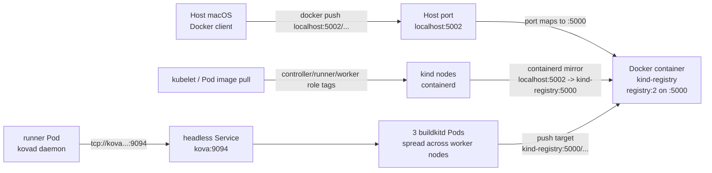

# Local Kind Registry

The local registry used by the kind development environment is a Docker
container, not a Kubernetes Pod or Service.

## Addresses

- Host access: `localhost:5002`
- Docker container name: `kind-registry`
- Registry port inside the Docker container: `5000`
- kind node mirror endpoint: `http://kind-registry:5000`
- BuildKit push target from Pods: `kind-registry:5000`

## Flow



## Why `localhost:5002` Works for Pod Images

`deploy/kind-cluster.yaml` configures kind node containerd with:

```toml
[plugins."io.containerd.grpc.v1.cri".registry.mirrors."localhost:5002"]
  endpoint = ["http://kind-registry:5000"]
```

This is only for image pulls performed by kind nodes. When Kubernetes sees an
image such as `localhost:5002/kova:runner-dev`, containerd inside the kind
node uses the mirror endpoint and pulls from the Docker container named
`kind-registry`.

Without this mirror, `localhost:5002` would mean localhost inside the kind node,
not the host machine.

## Why BuildKit Uses `kind-registry:5000`

The example build runs inside Pods and pushes the output image from BuildKit.
For that push path, the target registry is passed as:

```text
KOVA_IMAGE_REGISTRY=kind-registry:5000
```

The registry container and kind nodes share the Docker `kind` network, so this
name works on Linux and Docker Desktop without a platform-specific host alias.
The kind values configure BuildKit to treat it as an HTTP development registry.
Host-side verification still pulls the same content through `localhost:5002`.

## Related Targets

- `make kind-registry`: starts or reuses the `kind-registry` Docker container.
- `make kind-create`: creates the kind cluster and connects `kind-registry` to
  the kind Docker network.
- `make kind-load`: pushes the local controller, runner, and worker tags to the
  registry and loads them into kind nodes.
- `make e2e`: deploys BuildKit workers, creates a runner, builds the example
  image, pushes it, exports results, and verifies host-side pull.
- `make e2e-concurrent`: generates multiple tiny image contexts, builds them
  concurrently through the same headless Service, exports results, and verifies
  every pushed image can be pulled from the host. It also validates the exported
  JSONL result count, success flags, and minimum distinct BuildKit worker IPs.
