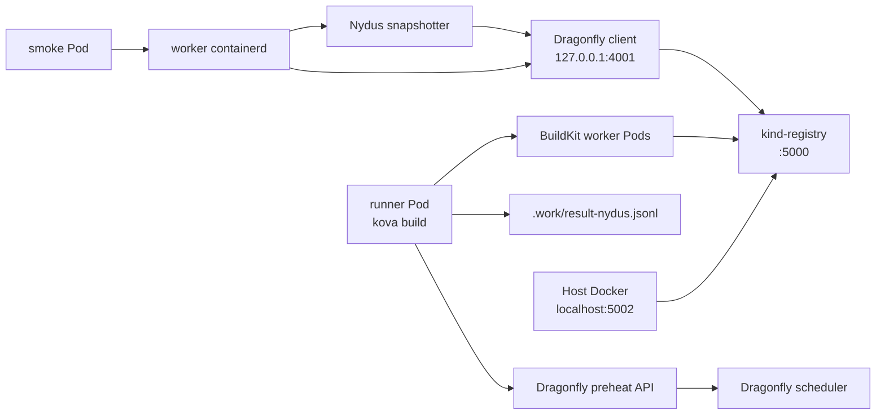
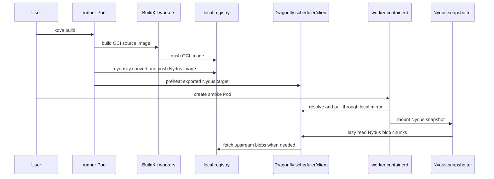

# Dragonfly And Nydus

Kova can build Nydus images and preheat the exported image list into a
Dragonfly P2P cluster. The local kind environment exercises the same core
runtime path with a local registry, Dragonfly, Nydus snapshotter, and a smoke
Pod that starts from the pushed Nydus image.

## Local Runtime Topology



The host reaches the registry as `localhost:5002`. Pods and kind worker nodes
use `kind-registry:5000` inside the Docker `kind` network.

## Build And Runtime Flow



## Local Commands

Run the Nydus and Dragonfly smoke:

```bash
make e2e-dragonfly-nydus
```

The target performs these steps:

- builds and publishes the local controller, runner, and worker tags
- deploys Kova workers
- installs Dragonfly and Nydus into `dragonfly-system`
- patches worker node containerd to use the `nydus` snapshotter
- builds `examples/nydus-smoke` as a Nydus image
- exports `.work/result-nydus.jsonl`
- preheats the exported image through Dragonfly
- starts `kova-nydus-test/kova-nydus-smoke`

Preheat requests verify registry TLS by default. The local validation scripts
pass `--insecure-skip-verify` explicitly because they use a development
registry; do not use that flag with a registry that has valid TLS.

A successful run ends with:

```text
pod/kova-nydus-smoke condition met
hello from kova
```

See the [runtime validation matrix](../testing.md) for the full E2E coverage,
including the OCI/Nydus runtime service smoke.

## Chart Versions

The local installer pins the Dragonfly Helm chart versions that have been
verified with the Kova smoke path:

- `dragonfly/dragonfly`: `1.7.4`
- `dragonfly/nydus-snapshotter`: `0.0.10`

Override `DRAGONFLY_CHART_VERSION` or `NYDUS_SNAPSHOTTER_CHART_VERSION` only
when intentionally testing an upgrade. Keep the values files in this repository
as the Kova-owned runtime contract, and leave upstream chart sources outside the
repository unless a chart template patch becomes necessary.

## Containerd Configuration

The local installer owns containerd mutation for kind worker nodes. It keeps the
Helm charts focused on deploying Dragonfly and Nydus Pods, then applies the
worker-specific runtime configuration:

- `snapshotter = "nydus"`
- `disable_snapshot_annotations = false`
- `discard_unpacked_layers = false`
- `[proxy_plugins.nydus]`
- local registry mirrors for `localhost:5002` and `kind-registry:5000`
- Dragonfly mirror headers pointing at `kind-registry:5000`

During install or upgrade, the script temporarily restores `overlayfs` before
rolling Dragonfly and Nydus. This avoids using the Nydus snapshotter to start
the Nydus snapshotter itself.

## Registry Addresses

The local environment intentionally uses two registry names:

- `localhost:5002`: host endpoint for Docker push/pull
- `kind-registry:5000`: image name used by Pods and BuildKit output

Both names are mapped on kind workers to `kind-registry:5000`, and the runtime
pull path goes through the Dragonfly client at `127.0.0.1:4001`.

## Environment Integration

Kubernetes environments should keep the same functional split:

- Kova builds OCI source images and converts Nydus targets.
- The target registry is provided by deployment values and build variables.
- Dragonfly and Nydus are deployed as cluster infrastructure.
- Runtime mirror and snapshotter configuration belongs to node/bootstrap
  automation, not to Kova application code.

For private registries, configure registry credentials in the target cluster and
keep registry-specific values out of the chart templates.
